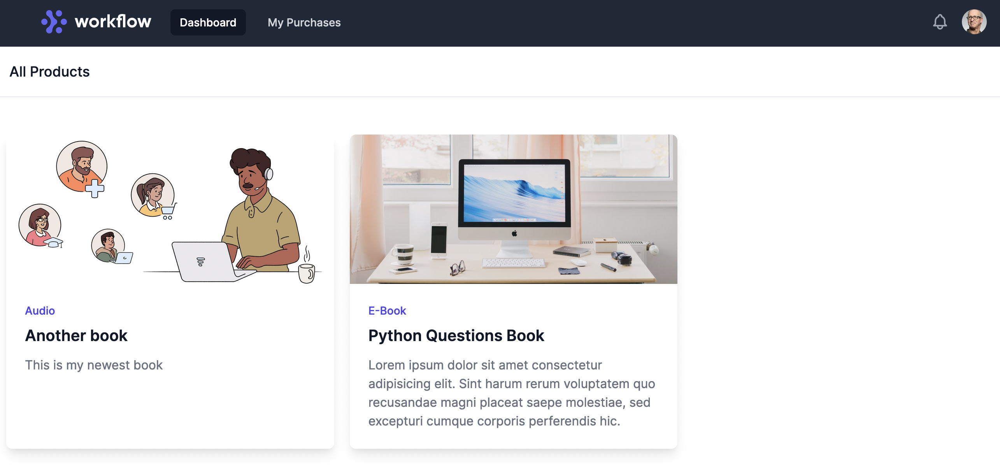
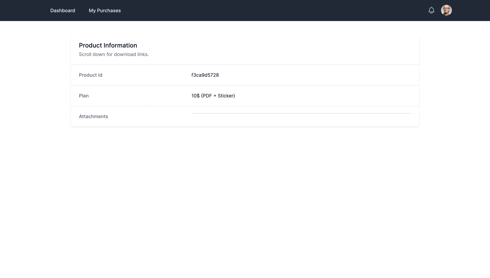
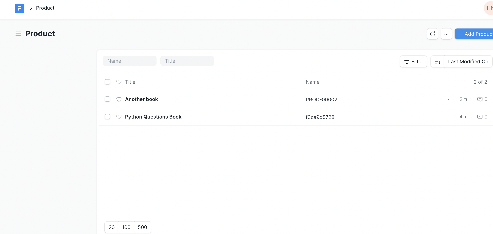
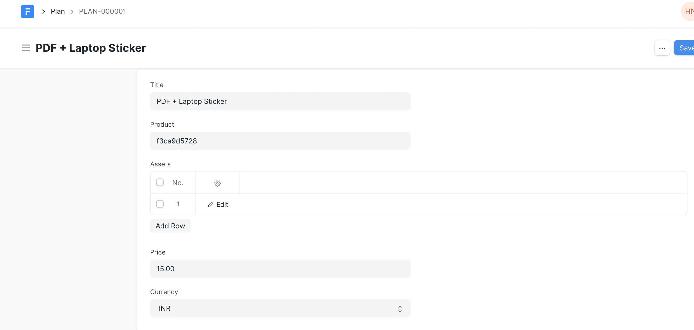

## Digistore

FOSS Digital Assets Marketplace. Distribute digital assets, like a pro.

[Video Demo Here](https://frappecloud.com/files/Screen%20Recording%202021-11-14%20at%209.30.31%20PM.mov)

## Features

- Create, attach and list digital assets (PDFs, mp3s, videos and more..)
- Modern and Clean UI (built using tailwindCSS)
- Single-page application for smooth UX
- Create products and add information (images, descriptions etc.)
- And create differents tiers (plans) for the products.
- Upload to S3

> Different plans can have different prices and a set of assets that go with the plan.

## Installation

1. Install Frappe Bench
1. Create a new site:

```bash
$ bench new-site <your-site>
```

4. Install `digistore` app

```bash
$ bench get-app https://github.com/NagariaHussain/digistore.git
$ bench --site <your-site> install-app digistore
```

## Demo

1. User Store Front



2. Users can only access thier purchased assets



3. Purchase directly through Stripe


3. Frappe Admin Interface: Let's you easily create products, plans, assets and more.





#### License

MIT
